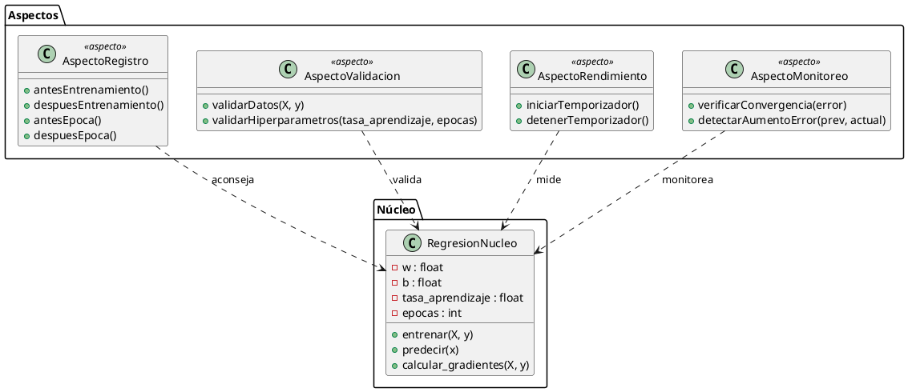

# Diseño con el Paradigma de Programación Orientada a Aspectos (AOP) para Regresión Lineal

Este documento presenta un diseño basado en la imagen proporcionada, adaptando la estructura al modelo mostrado: un **núcleo** central denominado `RegresionNucleo` y cuatro aspectos: `AspectoRegistro`, `AspectoValidacion`, `AspectoRendimiento` y `AspectoMonitoreo`.

---

## 1. Objetivo del diseño

Mantener la lógica esencial de la regresión lineal aislada en un componente central (*núcleo*), mientras que las funcionalidades transversales se implementan como aspectos independientes que se "tejen" sobre el núcleo para agregar validación, registro, monitoreo y medición de rendimiento.

---

## 2. Componentes principales del diseño

### 2.1 Núcleo: `RegresionNucleo`

Este módulo contiene únicamente la lógica de regresión:

- Parámetros internos: `w`, `b`, `tasa_aprendizaje`, `epocas`.
- Métodos principales:
  - `entrenar(X, y)`
  - `predecir(x)`
  - `calcular_gradientes(X, y)`

**Responsabilidad:** resolver la regresión lineal sin incluir código transversal.

---

### 2.2 `AspectoRegistro`

Aspecto encargado de registrar eventos importantes durante el entrenamiento.

**Métodos:**
- `antesEntrenamiento()`
- `despuesEntrenamiento()`
- `antesEpoca()`
- `despuesEpoca()`

**Relación con el núcleo:** *aconseja* (advices) el flujo del entrenamiento.

---

### 2.3 `AspectoValidacion`

Valida que los datos y los hiperparámetros sean adecuados antes de ejecutar el entrenamiento.

**Métodos:**
- `validarDatos(X, y)`
- `validarHiperparametros(tasa_aprendizaje, epocas)`

**Relación con el núcleo:** *valida* entradas antes de ejecutar métodos como `entrenar()`.

---

### 2.4 `AspectoRendimiento`

Aspecto que mide tiempo o métricas de desempeño del proceso.

**Métodos:**
- `iniciarTemporizador()`
- `detenerTemporizador()`

**Relación con el núcleo:** *mide* la ejecución de secciones relevantes, como cada época.

---

### 2.5 `AspectoMonitoreo`

Supervisa el comportamiento del error o el progreso del modelo.

**Métodos:**
- `verificarConvergencia(error)`
- `detectarAumentoError(prev, actual)`

**Relación con el núcleo:** *monitorea* la evolución del error después de cada iteración.

---

## 3. Flujo general del diseño

1. `AspectoValidacion` verifica datos y parámetros.
2. Se invoca `entrenar()` en `RegresionNucleo`.
3. `AspectoRegistro` marca inicio del entrenamiento.
4. Por cada época:
   - `AspectoRendimiento` inicia conteo de tiempo.
   - El núcleo calcula predicciones y gradientes.
   - `AspectoMonitoreo` revisa convergencia o aumento del error.
   - Se actualizan parámetros.
   - `AspectoRendimiento` detiene temporizador.
   - `AspectoRegistro` registra fin de la época.
5. Finaliza entrenamiento y los aspectos registran y monitorean resultados finales.

---

## 4. Ventajas

- Separación estricta entre lógica central y funcionalidades transversales.
- Los aspectos pueden activarse o desactivarse sin modificar el núcleo.
- Mejor mantenibilidad y claridad.

---

## 5. Posibles extensiones

- Agregar un `AspectoVisualizacion` para graficar la curva de error.
- Añadir un `AspectoDebug` para inspección profunda de estados.
- Incluir aspectos de auditoría o seguridad.

---

## Diagrama UML (PlantUML)

